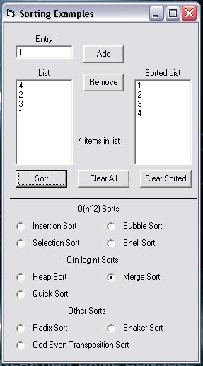



## Ten Different Sorting Methods

### Description

This program is to demonstrate the use of 10 different sorting methods. They all vary in speed and complexity. They are the following: Insertion Sort, Bubble Sort, Selection Sort, Shell Sort, Heap Sort, Merge Sort, Quick Sort, Radix Sort, Shaker Sort (Bi-Directional Bubble Sort), Odd-Even Transposition Sort). There will be more to come later on.
 
### More Info
 
Most of the functions just take the unsorted list and the number of elements in the array to be sorted. However, some of the functions will also require a temporary array that is of the same type and size as the unsorted array.

This program is written only as a demonstration of the functions themselves, which can be modified to sort characters or strings, or pretty much anything else. If you plan on using my code, please send me a message and mention me in your code. There will also be more different functions to come as I discover and understand them.

Just the sorted array!

None that I know of!

             |
---                |---
**Submitted On**   |2003-07-22 23:57:12
**By**             |[Guillaume Couture\-Levesque](https://github.com/Planet-Source-Code/PSCIndex/blob/master/ByAuthor/guillaume-couture-levesque.md)
**Level**          |Advanced
**User Rating**    |4.4 (35 globes from 8 users)
**Compatibility**  |VB 5\.0, VB 6\.0
**Category**       |[Miscellaneous](https://github.com/Planet-Source-Code/PSCIndex/blob/master/ByCategory/miscellaneous__1-1.md)
**World**          |[Visual Basic](https://github.com/Planet-Source-Code/PSCIndex/blob/master/ByWorld/visual-basic.md)
**Archive File**   |[Ten\_Differ1618917232003\.zip](https://github.com/Planet-Source-Code/guillaume-couture-levesque-ten-different-sorting-methods__1-47108/archive/master.zip)

